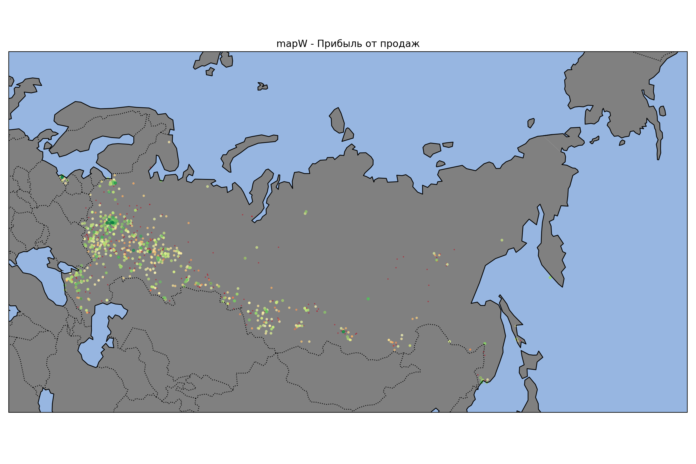

# BfoAnalysis

Приложение предназначено для скачивания отчетности компаний с bo.nalog.ru и помещения их в SQL. После чего по ним строятся графики, карты и считаются некоторые статистические показатели.

## Запуск

Установка библиотек: `pip install -r requirements.txt`. Также при первом запуске рисования `mapW` потребуется некоторое время на скачивание необходимых для отрисовки файлов (происходит автоматически).

Есть несколько способов запустить приложение:

1. `python3 main.py`. В таком варианте приложение само будет спрашивать вас обо всех необходимых для его работы данных.
2. `python3 main.py <ToDo> <Okved> <Year>`. Если вы уже знаете, какой именно процесс хотите запустить, то можете прямо указать это при запуске в `main.py`, включая все необходимые для него параметры.
3. `python3 <AnyFile.py> <Okved> <Year>`. Вы также можете напрямую запустить необходимый процесс из того python файла, который его обрабатывает. Это может потребоваться, например, если вы хотите отрисовать только карты. Тогда выполните `python3 drawMaps.py <file.txt>`.

>Все <параметры> являются необязательными. Если что-то будет нужно - приложение вас об этом спросит.

## Как пользоваться

### Режимы

1. `inn` - Скачиваются ИНН компаний из указанной пользователем отрасли (по номеру ОКВЭД2) и некоторая дополнительная информация, которую сразу предоставляет сайт. Это: название, огрн, регион и т.п. \
На этом этапе есть возможность посмотреть сколько компаний доступно для скачивания и указать их количество для загрузки. \
Данные загружаются в `data/data-okved-XX.db`
2. `data` - Для выбранных в `inn` компаний скачивается вся доступная на сайте отчетность (баланс, отчет о фин результатах и прочее). \
Также создается копия прошлой версии `data-okved-XX.db` и помещается в папку `copy`.
3. `plot` - по выбранной базе данных (указывается код ОКВЭД2) строятся графики, карты и считаются статистические показатели, такие как:
   1. Мат ожидание
   2. Дисперсия
   3. Среднее квадратическое отклонение
   4. Асимметрия
   5. Эксцесс
   6. Медиана
   7. Межквартальный размах
4. `addLoc` - Для работы `mapR` и `mapW` **обязательно** нужно определить местоположение компаний. Это делается по почтовому индексу, который подкачивается в процессе `inn`. Используемая библиотека по какой-то причине не может определить все индексы, но по большому счету работает неплохо.

### Работа с drawPlots.txt

При построении графиков и карт (`python3 main.py plot`) в файле `drawPlots.txt` указываются все настройки и сами графики. \
В части `config:` прописываются сокращения. По типу `B = balance`, а `c = current`.
Сокращения большими буквами всегда воспринимаются как названия таблицы из которой подгружаются данные. Маленькие - нужны для сокращения наименования колонок. Такая сложная система существует поскольку в оригинале все это записывается как `balance.current1100` для строки баланса 1100. Можно было бы, конечно, просто автоматически подгружать данные из нужной таблицы, смотря на номер строки, но ладно уж. Будет пока как есть.

>Обращаю ваше внимание, что код ОКВЭД2 анализируемой базы данных нужно написать в первой строчке `drawPlots.txt`

Далее - в каждом графике можно задать следующие параметры:

- `name:` Название графика
- `period:` Год, за который берутся данные. Чтобы взять 2 года нужно написать `period: 2024 or 2025`
- `nameX:` и `nameY:` Подписи соответствующих осей
- `xlim:` и `ylim:` Ограничить график по осям. Пишется как `xlim: -10 10.5`
- `parms:` Обширная штука. Позволяет задать множество разных настроек (указываются через пробел):

  - `DIS` - исключить повторяющиеся значения
  - `LOGx` и `LOGy` - логарифмирует значения по соответствующей оси
  - `symLOGx` и `symLOGy` - логарифмирует значения по соответствующей оси с учетом отрицательных значений. Плохо, что стандартная функция не позволяет просто сделать логарифм отрицательным, поэтому возле 0 ось становится линейной.
  - `STAT` - по значениям y графика будут рассчитываться статистические показатели
  - `NON` - (No None) - исключает пустые значения. (Работает на входных, а не выходных данных)
- `sortBy:` Укажите строки или уравнения, по которым будет идти сортировка и будет ли она по возрастанию `ASC` или по убыванию `DESC`. Вот пример: `sortBy: B.c1100 + B.c1200 ASC`
- `y:` и `x:` Непосредственно те уравнения, по которым будут строиться графики. Не обязательно прописывать уравнения для обоих осей. Можно указать только 1 и тогда по второй автоматически построится ряд значений \[1,2,4,...\]. \
Пример: `y: B.c1310 / B.c1600, F.c2100 / B.c1100` \
(Из-за особенностей SQL пока что во всех операциях нужно ставить пробелы между +, -, /, *).\
Данный код практически напрямую подставляется в функцию SELECT, поэтому можно использовать стандартные для sqlite функции по типу `POWER(B.c1100, 2)`.
- `legend:` Можно указать подписи для выборки от каждого применяемого уравнения
- `where:` Указать ограничения (по типу B.c1310 > 0). Код просто подставляется в SQL запрос, так что если то - все вопросы к нему
- `equation:` Рисует уравнение на графике. Добавил для того, чтобы сравнивать данные с нормативом, поэтому по умолчанию рисует красным. Пример заполнения `equation: <= 0.5 * x`
- `eColor:` Настраивает цвет для `equation`. Стандартные цвета пишутся прописью (`green`), можно указывать в HEX.
- `mapR:` и `mapW:` Отображают местоположение выборки компаний на карте. Определенный в функции показатель отображается в цвете и размере точек. Красный - минимальный, зеленый - максимальный. **Не используйте больше 1 уравнения в `y:` при расчете карт.**
- `pointSize:` Изменяет размер точек на картах. Может задаваться относительно рассчитываемых в `y:` значениях. Пример: `pointSize: 2*x+1.5`

## Примеры

